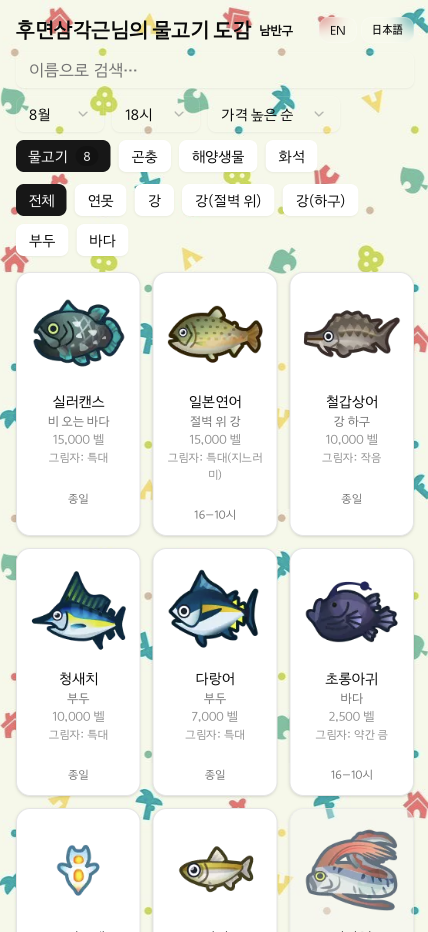
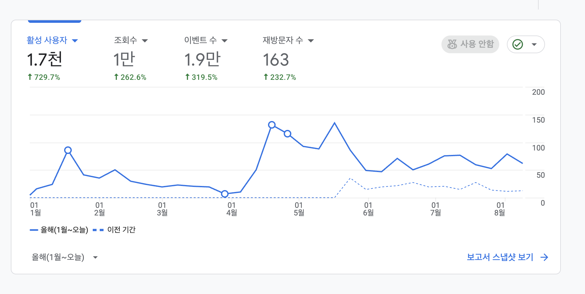
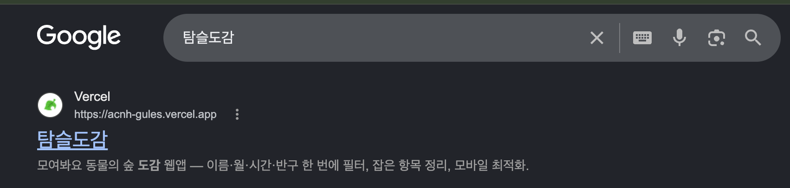
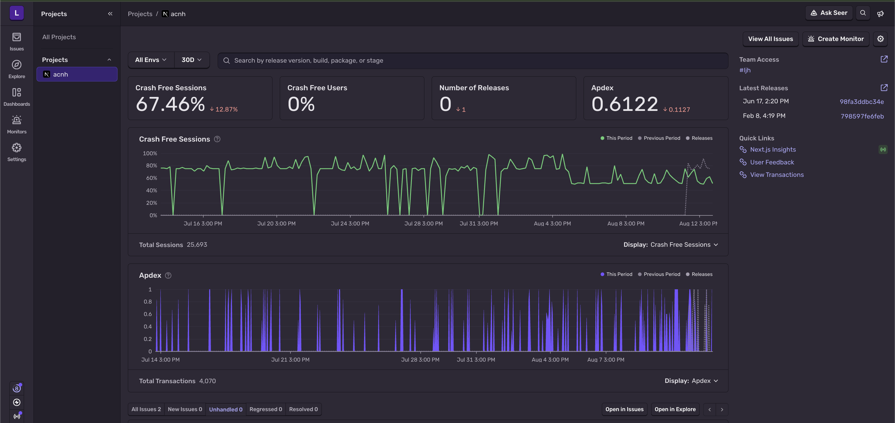

# 탐슬도감

모여봐요 동물의 숲 도감 데이터를 실시간으로 필터링하고 수집 현황을 관리하는 모바일 최적화 웹앱입니다.

[서비스 바로가기](https://acnh-gules.vercel.app/)



## 실제 운영 현황

개인 프로젝트로 개발한 뒤 실제 서비스를 운영하며 사용자 유입과 검색 노출, 운영 환경의 오류를 함께 확인하고 있습니다.

### 사용자 유입

GA4를 연동해 서비스 이용 현황을 확인하고 있습니다. 2026년 1월부터 8월까지 사용자 유입이 꾸준히 이어지고 있으며, 현재도 지속적으로 방문이 발생하고 있습니다.



### 검색 유입

별도의 앱 설치 없이 웹에서 바로 사용할 수 있도록 서비스를 공개했고, Google에서 `탐슬도감`을 검색하면 서비스가 검색 결과에 노출되고 있습니다.



### 운영 모니터링

실제 사용자 환경에서 발생하는 문제를 확인하기 위해 Sentry를 연동했습니다.

최근 30일 기준 약 **2.5만 건의 세션과 4천 건의 트랜잭션**이 기록되고 있으며, 운영 중 발생하는 오류와 사용자 실행 흐름을 지속적으로 확인하고 있습니다.



---

## 핵심 구현

### 1. 낙관적 업데이트와 실패 시 상태 복구

> 사용자 선택을 화면에 먼저 반영하고, 요청 결과에 따라 서버 값으로 보정하거나 이전 상태로 되돌립니다.

#### 문제

수집한 항목을 선택할 때 서버 응답을 기다린 뒤 화면을 갱신하면, 네트워크 지연에 따라 클릭 후 1~2초 동안 UI가 반응하지 않았습니다.

#### 낙관적 업데이트를 선택한 이유

- 서버 응답 후 상태 변경: 데이터 흐름은 단순하지만 1~2초의 UI 지연이 그대로 발생
- 로딩 상태 표시: 요청 중임은 알릴 수 있지만 사용자가 기대한 결과를 즉시 제공하지 못함
- 수집 여부: `수집/미수집` 두 상태만 가지므로 요청 전에 결과를 예측하고 실패 시 반전해 복구 가능
- 서버 응답: 최종 `caught` 값을 반환하므로 정상 처리 후 서버 상태로 보정 가능

즉각적인 피드백과 실패 복구를 함께 제공할 수 있다는 점에서 낙관적 업데이트를 선택했습니다.

#### 구현 과정

##### 1. 서버의 수집 목록을 `Set`으로 저장하고 조회

```tsx
// useCaughtItems.ts
const data = await assertJson<ApiCaughtResponse>(res)
setCaughtSet(new Set(data.items ?? []))

// ItemsGrid.tsx
const isCaught = caughtSet.has(item.originalName)
```

- 서버에서 받은 항목 이름 배열을 `Set<string>`으로 변환해 저장
- 카드 렌더링 시 `Set.has()`로 해당 항목의 수집 여부 확인
- 수집 여부를 반복 조회하므로 `Set.has()` 활용

##### 2. 서버 요청 전에 선택 상태를 먼저 반영

```tsx
setCaughtSet((prev) => {
  const next = new Set(prev)

  if (next.has(itemName)) next.delete(itemName)
  else next.add(itemName)

  return next
})
```

- 카드 선택 시 `toggleCatch(itemName)` 실행
- 함수형 업데이트로 이전 상태를 전달받아 `new Set(prev)`로 복사
- 서버 요청 전에 해당 항목의 포함 여부를 반전
- 새로운 `Set` 참조를 반환해 카드 스타일, 정렬 위치, 남은 항목 수를 즉시 갱신

##### 3. 서버가 반환한 최종 값으로 상태 보정

```tsx
const data = await assertJson<ApiToggleResponse>(res)

setCaughtSet((prev) => {
  const next = new Set(prev)

  if (data.caught) next.add(itemName)
  else next.delete(itemName)

  return next
})
```

- `POST /api/caught/toggle` 요청 후 서버의 최종 수집 여부를 `caught`로 수신
- `caught: true`이면 항목을 추가하고, `false`이면 삭제
- 낙관적으로 반영한 값과 서버 값이 다를 경우 서버 응답을 기준으로 보정

##### 4. 예외가 발생하면 낙관적 변경 취소

```tsx
catch (e) {
  console.error("POST /api/caught/toggle failed:", e)

  setCaughtSet((prev) => {
    const next = new Set(prev)

    if (next.has(itemName)) next.delete(itemName)
    else next.add(itemName)

    return next
  })
}
```

- 네트워크 또는 응답 파싱 예외 발생 시 `catch` 실행
- 낙관적으로 변경한 항목을 한 번 더 반전해 이전 상태로 복구
- 별도 스냅샷 대신 두 번째 반전을 이용하는 단일 요청 기준의 복구 방식

#### 결과

- 네트워크 응답을 기다리지 않는 즉각적인 시각 피드백
- 정상 응답 후 서버 값을 기준으로 해당 항목의 상태 보정
- 단일 요청에서 예외 발생 시 낙관적 변경 복구

---

### 2. 쿼리 파라미터 기반 탭 상태 관리

> URL을 활성 탭의 기준으로 사용해 새로고침, 브라우저 히스토리 이동, URL 공유에서도 선택 상태를 유지합니다.

#### 문제

탭을 클라이언트 상태로만 관리하면 새로고침 시 기본 탭으로 초기화되고, 뒤로가기와 앞으로가기에도 사용자의 탭 이동이 반영되지 않았습니다.

#### 쿼리 파라미터를 선택한 이유

- React state: URL에 상태가 남지 않아 새로고침·히스토리 이동·URL 공유 시 탭 복원 불가
- 개별 route: 선택 상태를 URL로 표현할 수 있지만 카테고리마다 별도 경로 구성 필요
- 쿼리 파라미터: 하나의 도감 화면 구조를 유지하면서 선택한 탭만 URL에 기록 가능

화면 구조를 유지하면서 탭 상태를 복원하고 공유할 수 있다는 점에서 쿼리 파라미터 방식을 선택하고, 탭과 URL을 연결하는 로직을 `useQueryTab` 훅으로 분리했습니다.

#### 구현 과정

##### 1. 사용할 탭과 기본값 정의

```tsx
const CATEGORY_TABS: Category[] = ["fish", "bug", "sea", "fossil"]

const { activeTab, setTab } = useQueryTab<Category>("tab", "fish", CATEGORY_TABS)
```

- URL에 사용할 쿼리 키를 `tab`으로 지정
- 파라미터가 없을 때 사용할 기본 탭을 `fish`로 지정
- 허용할 값을 `fish`, `bug`, `sea`, `fossil`로 제한

##### 2. URL에서 활성 탭 결정

```tsx
const searchParams = useSearchParams()
const currentTab = searchParams.get(key) as T
const isValid = currentTab && validTabs.includes(currentTab)
const activeTab = isValid ? currentTab : defaultValue
```

- `useSearchParams()`로 현재 URL의 `tab` 값 조회
- `validTabs.includes()`로 허용된 카테고리인지 검사
- 유효한 값은 `activeTab`, 없거나 잘못된 값은 기본값 `fish`로 결정
- 별도의 탭용 React state 없이 URL을 활성 탭의 기준으로 사용

##### 3. 탭을 선택하면 URL 변경

```tsx
const setTab = (tab: T) => {
  const params = new URLSearchParams(searchParams)

  params.set(key, tab)
  router.push(`?${params.toString()}`)
}
```

- `useSearchParams()`가 반환한 읽기 전용 값을 `URLSearchParams`로 복사
- 기존 쿼리 파라미터를 유지하면서 `tab` 값만 새 카테고리로 교체
- `router.push()`로 변경된 URL을 히스토리에 추가
- URL 변경 후 `activeTab` 재계산

**`router.push`를 선택한 이유**

| 방식 | 히스토리 동작 | 탭 탐색에 미치는 영향 |
| --- | --- | --- |
| `router.push` | 변경된 URL을 새 항목으로 추가 | 뒤로가기·앞으로가기로 이전 탭 복원 가능 |
| `router.replace` | 현재 히스토리 항목을 교체 | 이전 탭 선택 기록이 남지 않음 |

- 탭 변경을 사용자의 탐색 흐름으로 보고 이동 기록을 남기는 `router.push` 선택

##### 4. URL 변경을 데이터 조회까지 연결

```tsx
const { items, loading: itemsLoading } = useAcnhItems({
  category: activeTab,
  // 사용자 및 필터 조건
})

const { caughtSet, toggleCatch, loading: caughtLoading } = useCaughtItems({
  category: activeTab,
  // 사용자 조회 조건
})
```

- `activeTab`을 도감 아이템과 수집 목록의 조회 카테고리로 전달
- URL의 `tab` 변경 시 두 훅의 `category` 값도 변경
- 변경된 카테고리에 맞춰 도감 데이터와 수집 목록 재조회

#### 결과

- 새로고침 후에도 URL을 기준으로 선택한 카테고리 복원
- 뒤로가기·앞으로가기 시 히스토리의 `tab` 값에 맞춰 화면 변경
- `/ko/list?tab=sea`처럼 특정 탭이 선택된 URL 공유 가능
